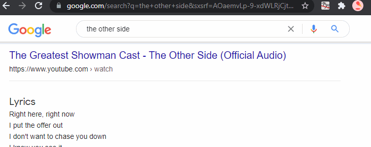
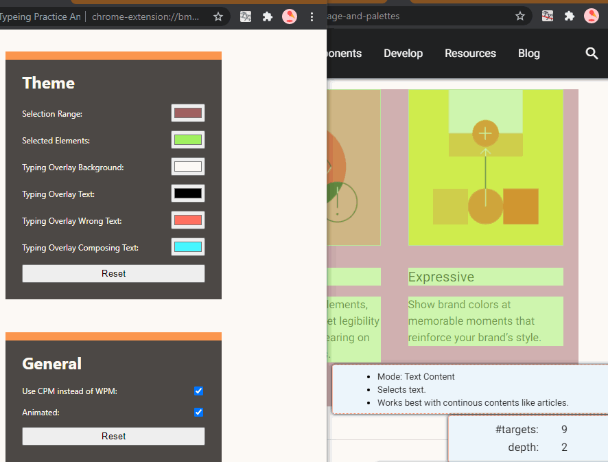

# Typing Practice Anywhere

Typing Practice Anywhere is a chrome extension that motivates you to practice keyboard typing.

What It Does:
* Motivates typing practice with your favorite text to type out.
* Shows typing practice overlay inside any webpages.
* Analyzes your typing performance.

Use Cases:
* Checking how fast you can type with the web content you are interested in
* memorizing terminology / spelling / lyrics / phrases
* Learning foreign languages by typing out foreign web contents

# Practice Typing with any Web Contents

Typing Practice Anywhere provides simple and easy-to-use UI. To start typing practice at the current page, click the extension icon in the toolbar. The extension will highlight web contents as the mouse cursor hovers over them. Click the contents you are interested in, and here you go! Show how fast you can type!

# Composing Input Supported

(image from https://www.w3.org/TR/ime-api/)

There are a input method called "composing". It's often used when there are one-to-many relationship between what you've typed and what you've intended to express, like when using handwriting keyboard or the Japanese language.

Typing Practice Anywhere comes with a special handling for that kind of input method. There's nothing to care about, just type as you normally do, then the extension will do the job.

# Press <kbd>Tab↹</kbd> to skip characters

You can insert the correct characters by pressing the <kbd>Tab</kbd> key.

Depending on your keyboard or input method, you may face a un-typeable character. In that case, no need to worry, you can skip that character by pressing the <kbd>Tab</kbd> key. This will insert the un-typeable character.

This feature works with selection as well. If you press the <kbd>Tab</kbd> key after selecting part of the text you typed, the whole selection will be replaced by the correct text.

When Typing Practice Anywhere have done something stupid, and picked some text that you don't want to type out, you may want to press the <kbd>Tab</kbd> key continuously to skip every character in the box. That would work, but in this case, <kbd>Shift</kbd>+<kbd>Tab</kbd> is the right hammer to go with. Using <kbd>Shift</kbd>+<kbd>Tab</kbd>, you can proceed to the next text like when you've typed everything correctly. The extension will skip the whole box and pick another box, hoping you like it this time.

# Customizable Theme

(image from https://material.io/design/color/the-color-system.html#color-usage-and-palettes)

Choose the best-fit colors for your environment! Changes will be applied immediately so that you can see how cool your color looks like as you tweak them.

# Alpha Version Now
I used to type out what I want to memorize, and it was quite effective. As many of the contents I was memorizing were from the Internet, I have automated what I was doing by integrating the process into the web browser as this extension.

I'm now actively maintaining this extension to fix bugs and expand functionality. So any bug reports or feature requests are welcome. I'll appreciate any of them.

# Planned features
* support for translation (i18n)
* elaborated selecting mode
* detailed result screen

# Changelog
* 0.1.1
  * bugfix: the extension's option page failed to load initial theme

# See Also
* [chrome webstore](https://chrome.google.com/webstore/detail/typeing-practice-anywhere/ndioekgfjeeapmocoohoboiaeigjeojg)
